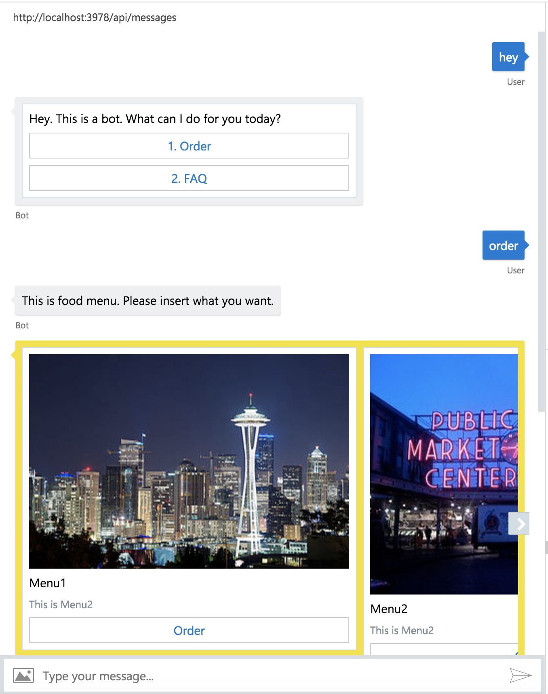

# chatbot_node_botbuilder_sdk3

Sample chatbot code of Bot Framework with Node. This bot's scenario is based on [the book's sample](https://github.com/KoreaEva/Bot)



## Environment

- [BotBuilder SDK3](https://github.com/Microsoft/BotBuilder-V3)
- [BotFramework-Emulator](https://github.com/Microsoft/BotFramework-Emulator/releases)

## Get started

```
$ npm install
$ npm run start
```

## Use Visual Studio Code

### Build and debug

1. download source code zip and extract source in local folder
2. open the source folder in Visual Studio Code
3. make code changes
4. download and run [botframework-emulator](https://emulator.botframework.com/)
5. connect the emulator to http://localhost:3987

### Publish back

```
npm run azure-publish
```
